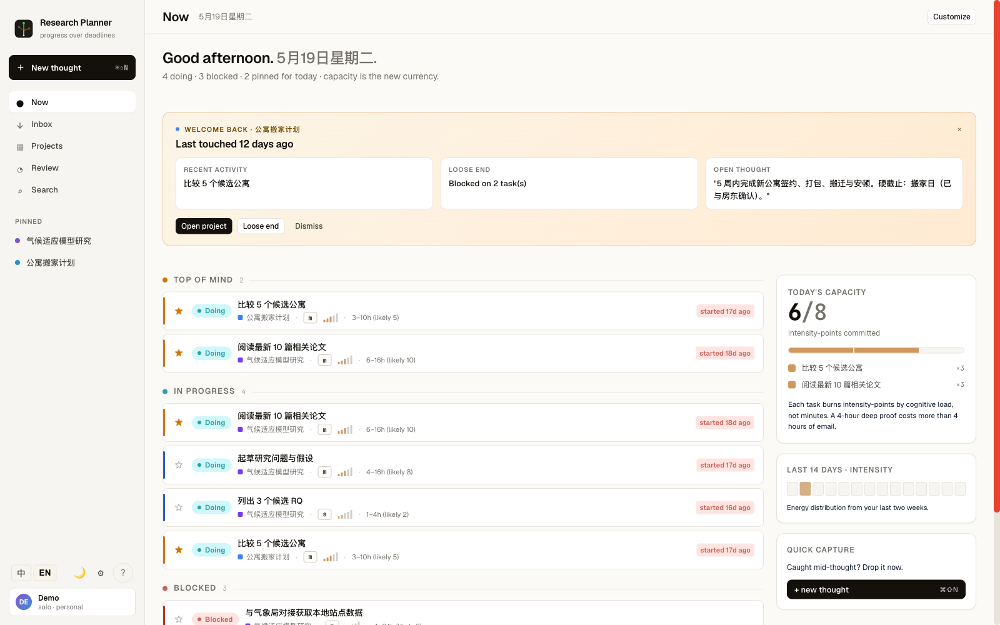
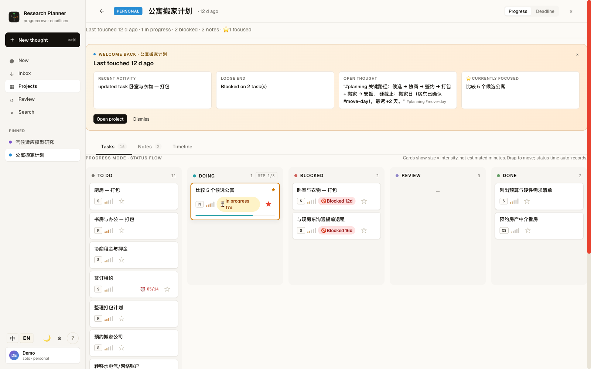
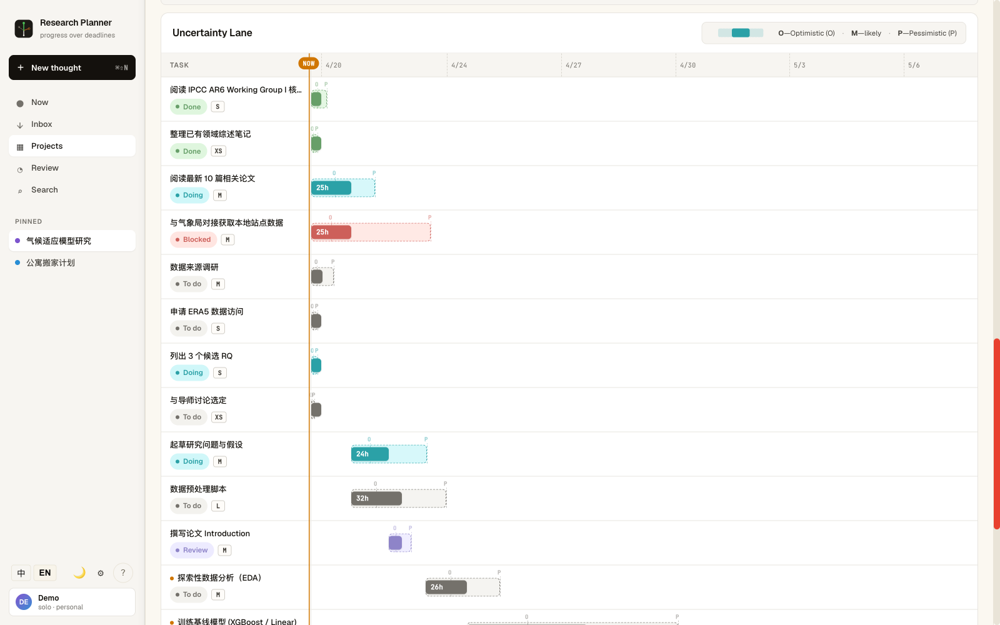
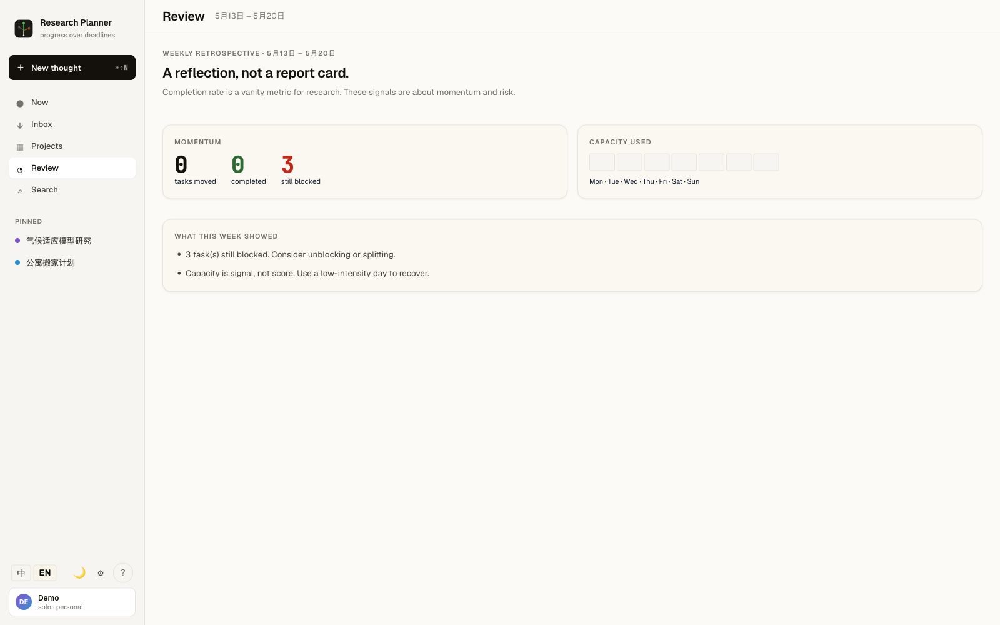

<div align="center">

# Research Planner

**A planner for projects where you don't know what the next task is yet.**

*Built for research, design exploration, and other work whose durations are genuinely uncertain — where progress matters more than deadlines.*

[](LICENSE)
[](https://github.com/xtao-sh/research-planner/actions/workflows/ci.yml)
[](https://www.typescriptlang.org/)
[](apps/web/src/i18n/locales)

[Why it exists](#why-it-exists) · [Distinctive features](#distinctive-features) · [Screenshots](#screenshots) · [Quick start](#quick-start) · [Status](#status)

</div>

---

## Why it exists

Most project trackers — Jira, Linear, Asana, even Notion — were designed for **scoped engineering work**: you know what to build, the question is *when*. They treat every task as a known-duration block on a calendar.

That model breaks the moment your work is genuinely uncertain:

> *"I think this experiment takes a week. It might take three. Or I might realise on day two that the whole approach is wrong."*

Researchers, PhD students, designers, independent makers, and anyone running multiple long-running exploratory threads will recognise the shape of this problem. The traditional response — fill in an estimated due date and pretend — generates anxiety without generating clarity.

**Research Planner is built around the opposite premise**: when a task's duration is unknown, **progress is the signal**, not a missed deadline. The product is shaped by three beliefs:

1. **Progress > deadlines.** What you're *currently doing* and what's *stuck* is more useful than a Gantt-chart fiction.
2. **Capture > structure.** A thought should reach the inbox in one second. Tags, estimates, and dependencies are optional.
3. **Context on re-entry.** Opening a project after two weeks away should tell you *where you left off* — not show you an undifferentiated task list to re-read.

---

## Distinctive features

### 🌫️ Uncertainty Lane
Visualise tasks as **PERT confidence cones** (Optimistic / Most-likely / Pessimistic) instead of single-point bars. The lane shows the *range* you're operating in, and the critical path is highlighted across the cones — not pretending a 3‑week stretch is "exactly Tuesday."

### 🧭 Two modes per project
- **Progress mode** (default) — Flow board (kanban) + notes. Hides Gantt, dependencies, and scheduling until they're actually useful. The view for "I'm exploring."
- **Deadline mode** — Full Gantt, scenarios, PERT-driven scheduling, critical-path, soft/hard due dates. The view for "this paper must be submitted by the 15th."

Switching is one click per project. Most projects live in progress mode forever.

### ⚡ Capacity as currency
Estimates are in **intensity points** (1–5 per task), not hours. You set a daily intensity *budget* — your cognitive ceiling, not your seat-hours. The "/now" view tells you when you've over-committed your day, regardless of what hours the wall clock says.

### 📥 Quick capture (⌘⇧N from anywhere)
A note in the inbox in one keystroke. No project, no fields, no estimate. Inline hashtags (`#literature #q3`) auto-extract on save. Triage later — or never.

### 🔍 Top-of-Mind (`/now`)
The first thing the app shows you: what you're *doing*, what's *blocked*, what you *pinned* for today. Not a chronological backlog — a reading of the moment. Includes:
- **Stuck-task detection** — surfaces tasks that have been `doing` >7 days or `blocked` at all.
- **Project re-entry briefings** — when you open a project after >3 days, a card summarises what you left mid-flight.
- **Capacity rail** — live counter of your committed intensity vs. today's budget.

### 🎲 Scenarios
Save the current schedule as a named **scenario**, then change something — defer a task, add capacity, drop a dependency — and overlay the new schedule against the saved one as a faint dashed reference. "What if I commit four hours a day instead of eight" becomes a one-click question.

### 🪞 Weekly retrospective (`/review`)
A reflection page, not a report card. Asks *"what surprised you this week"* — not *"did you hit your sprint goals."* Surfaces dormant projects (no activity >14 days), capture counts, what's still blocked.

### 🔁 Realtime + multi-user
Built on a Fastify WebSocket layer with presence (who's looking at which project), event broadcasting (project/task/note changes propagate to other connected sessions), and proper per-workspace role-based access. The default deployment is **single-user / loopback-only**; multi-user mode is a one-env-var flip.

### 🖥️ Self-contained native macOS app
Bundled as a Tauri app with a Bun-compiled API sidecar — a single signed `.app` that runs offline, ships with a seeded SQLite database, and has no external service dependency. (Linux and Windows builds are mechanical to add.)

---

## Screenshots

> Screenshots live in [`docs/screenshots/`](docs/screenshots/). See the [capture brief](docs/screenshots/README.md) for what each image is meant to convey.

| Top-of-Mind | Flow Board |
|---|---|
|  |  |

| Uncertainty Lane | Weekly Review |
|---|---|
|  |  |

---

## Quick start

**Requirements**: Node 20+, npm 10+. Optional: Bun (only if building the Tauri sidecar), Rust toolchain (only if building the native app).

```bash
# Clone + install
git clone https://github.com/xtao-sh/research-planner.git
cd research-planner
npm install

# Seed the local SQLite + start both web + server in dev mode
cd apps/server && npx prisma migrate deploy && cd ../..
npm run dev

# → web at http://localhost:5173
# → API at http://localhost:4000
```

The dev script starts the Fastify API on `:4000` and the Vite dev server on `:5173`. The default deployment is **single-user, loopback-only** (no auth required, no LAN exposure). See [`apps/server/.env.example`](apps/server/.env.example) to flip on multi-user / network mode.

### Build the self-contained macOS app

```bash
cd apps/web
npm run tauri:build        # ./src-tauri/target/release/bundle/macos/Research Planner.app
```

The script Bun-compiles the API into a single binary sidecar (~60 MB), seeds a SQLite database, and embeds both into the `.app` bundle. First launch copies the seed database to `~/Library/Application Support/com.researchplanner.desktop/`.

---

## Tech stack

| Layer | Choice |
|---|---|
| Frontend | React 18 · Vite · TypeScript · @dnd-kit · i18next (EN / 中文) |
| Backend | Fastify · Prisma · SQLite (default) / Postgres · WebSocket (in-house presence + broadcast) |
| Desktop | Tauri 2 · Bun-compiled sidecar |
| Testing | Vitest (19 web + 127 server tests) · Prisma test fixtures |
| Type system | Shared `@rp/shared` package for cross-stack types · zod where it earns its keep |

---

## Status

The project is **alpha but daily-usable**. The author uses it as the primary planner for real research work. It's not production-deployed for paying users; expect rough edges, some unimplemented affordances, and breaking-change migrations between minor versions until 1.0.

What works today:
- ✅ Full task + project + note CRUD with realtime sync
- ✅ Flow Board, Task List, Gantt, Uncertainty Lane, Calendar Capacity views
- ✅ Quick Capture · Top-of-Mind · Search (server-side) · Command Palette (⌘K)
- ✅ Scenarios + PERT scheduling + critical-path
- ✅ Multi-workspace with role-based access (owner / admin / writer / viewer)
- ✅ Self-contained `.app` build (macOS); structure ready for Linux/Windows
- ✅ Dark mode · EN/中文 locale switch
- ✅ Accessible focus traps, per-route error boundaries, toast system

What's deliberately not built yet:
- ⏳ Mobile-first responsive layouts (the app works on tablet, but is desktop-first by design)
- ⏳ Email integration / reminder loop
- ⏳ Public sharing / read-only project links
- ⏳ Native Linux / Windows desktop builds (Tauri config is portable but untested)

---

## Contributing

PRs welcome — see [CONTRIBUTING.md](CONTRIBUTING.md) for setup, commit style, and the (deliberately small) scope guidelines.

Bug reports are most useful when they include: the workspace + project mode, the exact action sequence, what you expected, what happened. Screenshots help.

---

## Documentation

- **Product narrative & PRD**: [`docs/PRD-Research-Planner.v2.zh-CN.md`](docs/PRD-Research-Planner.v2.zh-CN.md) (Chinese; the source-of-truth for product direction)
- **Architecture**: [`docs/TECH-ARCH-Research-Planner.zh-CN.md`](docs/TECH-ARCH-Research-Planner.zh-CN.md)
- **Screenshot capture brief**: [`docs/screenshots/README.md`](docs/screenshots/README.md)

---

## License

[MIT](LICENSE) © 2026 Tao ([@xtao-sh](https://github.com/xtao-sh)).

The MIT license keeps copyright with the author while granting permissive use rights. You may use, fork, modify, and redistribute, including commercially — please retain the copyright notice.

---

<div align="center">

*If this tool fits how your brain works, I'd love to hear about it.*

</div>
